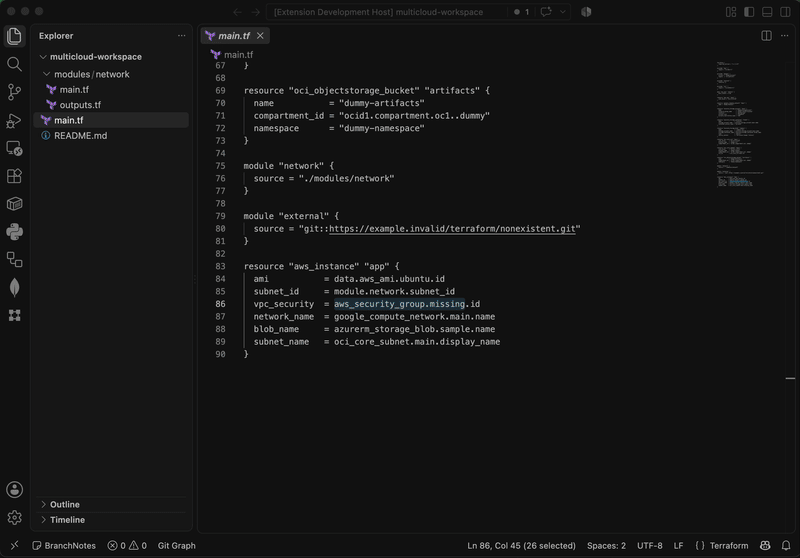

# Terraform Viewer

Terraform Viewer is a VS Code extension for inspecting multi-provider Terraform architecture as an interactive graph.

<p align="center">
  
</p>

## Features

- Finds `.tf` files in the current workspace.
- Displays resources from any provider, plus `data` sources and module boundaries.
- Connects resources through direct Terraform references, including references across files.
- Opens the source resource in the editor when a graph node is clicked.
- Refreshes the graph after Terraform files are saved.
- Runs Cytoscape from the packaged extension, so the graph does not require a CDN or Internet access.
- Provides selectable graph layouts: `Technical (concentric)`, `Hierarchical (dagre)`, `Architecture (elk)`, `Radial (circle)`, `Grid (grid)`, and `Free (cose)`.
- Saves the complete graph as a PNG image with **Save image**.
- Reports unreadable or unsupported Terraform files without hiding valid resources from other files.
- Generates a Copilot prompt file with the current Mermaid graph for generating architecture documentation.
- Can optionally download Git-based external modules into `.vscode/terraform-viewer/modules/` for deeper graph expansion.
- Remembers one global external-module decision per workspace in `.vscode/terraform-viewer/decisions.json`.

## Usage

Open the Command Palette and run **Terraform Viewer: Show Architecture Graph**. The extension opens the architecture graph in a new editor tab. Use **Terraform Viewer: Refresh Graph** to rebuild it manually.

The Terraform Viewer activity-bar view shows the current resource count and diagnostics after the graph has been loaded. The graph opens with `Technical (concentric)`, which places highly connected resources near the center. Use the layout selector to switch to a hierarchical, architecture-focused, radial, grid, or free-force view. The label includes the Terraform resource type and instance name in every layout.

Use **Save image** to save a PNG of the complete graph, including nodes outside the current viewport.

## Architecture documentation

<p align="center">
  
</p>

Use **Generate Documentation Prompt** in the graph toolbar to create `.github/prompts/terraform-architecture-documentation.generated.prompt.md`. The generated prompt includes the current Mermaid graph and asks Copilot to inspect the Terraform repository and write a presentation-ready Markdown document to `docs/terraform-architecture.md`. It allows several focused Mermaid diagrams when one diagram would be too dense. The file is opened automatically after generation so you can review or invoke it manually.

After the file is generated and opened, the extension asks whether you want to run it in Copilot Chat. Choose **Run in Copilot** to open the chat with `/terraform-architecture-documentation-generated` prefilled, or **Keep open** to review the file and run it later. Copilot uses the model selected in your current chat. The prompt file remains in the workspace so you can review, version, or regenerate it before running it.

The base prompt can be customized in **Settings → Extensions → Terraform Viewer → Documentation Prompt**, or with:

```json
{
  "terraformViewer.documentationPrompt": "Act as an expert in Terraform and cloud architecture..."
}
```

## Current scope

The current MVP recognizes `resource` and `data` blocks from any provider and resolves direct references such as:

```hcl
resource "aws_instance" "main" {
  subnet_id = aws_subnet.main.id
}
```

Local modules are inspected and their nodes are namespace-prefixed, for example `module.network.aws_vpc.main`. Git-based external modules can be downloaded after one global project decision and are read from the viewer-only cache at `.vscode/terraform-viewer/modules/`. The decision is stored as `download` or `skip` in `.vscode/terraform-viewer/decisions.json`; use **Terraform Viewer: Reset External Module Decision** to ask again. The original `source` declarations and Terraform files are never changed, and the extension does not execute `terraform init`, `plan`, or `apply`. Registry modules, HTTP archives, private repositories, and sources requiring credentials may remain unresolved.

The integration fixture includes a seed module at `test/fixtures/terraform-viewer-dummy-module`. Publish that directory as `terraform-viewer-dummy-module`, tag it `v1.0.0`, and ensure the GitHub URL in `test/fixtures/multicloud-workspace/main.tf` matches the account that owns it before testing the opt-in download path.

References that cannot be mapped to an available node are listed with their file, source range, and reason instead of being silently discarded. Valid `variable` and `output` blocks are accepted without parse diagnostics, but they are not rendered as graph nodes. Dynamic expressions and full HCL evaluation remain intentionally limited.

The repository includes a no-credentials multi-cloud integration fixture at `test/fixtures/multicloud-workspace`, with AWS and Google resources, a data source, an accessible local module, an inaccessible external module, and an intentionally unmapped reference.

## Development

```sh
npm install
npm run compile
npm run lint
npm run test:unit
```

Use **Run Terraform Viewer Extension** from the Run and Debug view to launch an Extension Development Host. Integration tests use the existing VS Code test harness:

```sh
npm run test:integration
```

Build a VSIX with `npm run package`.

## Limitations

Terraform parsing is intentionally incremental in this first version. Complex expressions and malformed blocks may produce diagnostics or remain unresolved. The graph is derived from the current Terraform files; the extension does not generate or persist a copy of the graph in the repository.

## License

MIT
